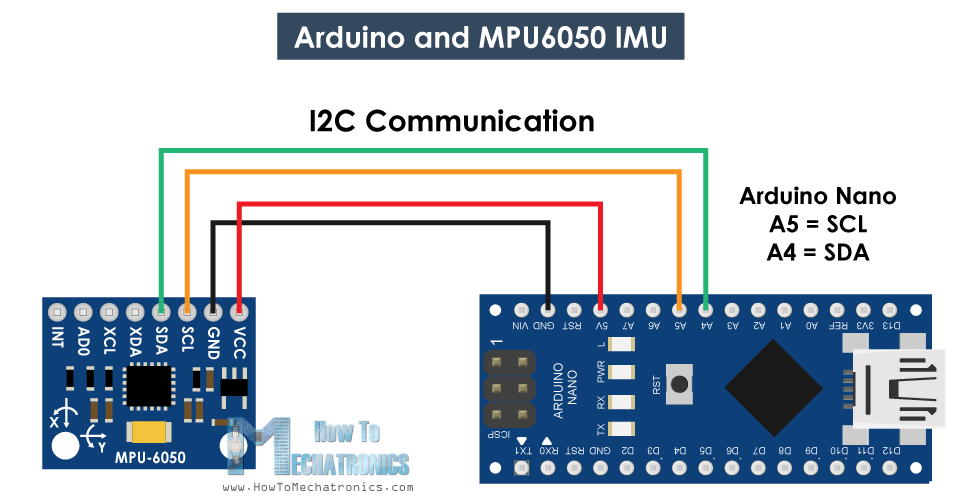

# MPU6050 ile Arduino'da hesapladığımız açıyı seri port ile MATLAB'a göndermek
İlk önce Arduino kodumuz olan mpu6050_aciyi_bul_seri_porttan_gonder.ino dosyasını Arduino'ya yükleyin. 
Ardından MATLAB kodumuz olan read_angle_serial_port.m dosyasını doğru port ismini girerek çalıştırın. 
Doğru portu bulmak için MATLAB'ı açınca serialportlist komutunu kullanabilirsiniz veya Windows'da Aygıt Yöneticisi'ne gidip orada Bağlantı Noktaları (Com ve LPT) üzerine tıklayabilirsiniz. 
Yukarıda Code yazan yeşil bağlantıya tıklarsanız bu sayfadaki kodları zip dosyası halinde bilgisayarınıza indirebilirsiniz.
   
    
# Videoyu aşağıdaki bağlantıdan izleyebilirsiniz 
  
